# Credit_Risk_Analysis

## Overview
Credit risk is an inherently unbalanced classification problem, as good loans easily outnumber risky loans. We will be employing different techniques to train and evaluate models with unbalanced classes. Using the credit card credit dataset from LendingClub, a peer-to-peer lending services company, we will evaluate the performance of these models to see if they should be used to predict credit risk. 

## Machine Learning Models
Using imbalanced-learn and scikit-learn libraries, we will evaluate three machine learning models by using resampling to determine which is better at predicting credit risk. Our original target values are the following:
-	Low_risk: 51357
-	High_risk: 255

When reviewing the machine learning models keep the following information in mind:
•	Precision: Precision is the measure of how reliable a positive classification is. 
•	Recall: Recall is the ability of the classifier to find all the positive samples. 
•	F1 score: F1 score is a weighted average of the true positive rate (recall) and precision, where the best score is 1.0 and the worst is 0.0.
•	Balanced accuracy score: Balanced accuracy is the average between the sensitivity and the specificity.

## Oversampling
In oversampling, the minority class are randomly selected and added to the training set until the majority and minority classes are balanced. We will compare two oversampling algorithms to determine which algorithm results in the best performance. In oversampling, our resampled target values are the following:
-	Low_risk: 51357
-	High_risk: 51357

### Naïve Random Oversampling	
<b>Balanced accuracy score:</b> 62.4% 

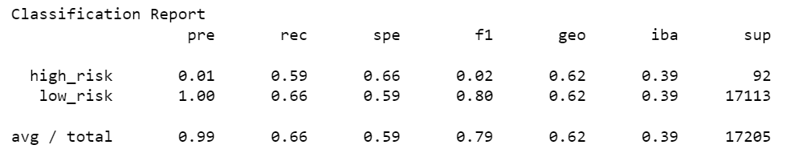

-	The high_risk precision is 1% with a sensitivity of 59%, making the F1 a 2%.
-	The low_risk precision is 100% with a 66% sensitivity, making the F1 an 80%.
-	The average precision of this model is a 99% with a sensitivity of 66%.

### SMOTE Oversampling
<b>Balanced accuracy score:</b> 61.8% 

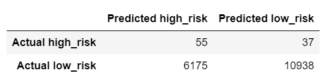

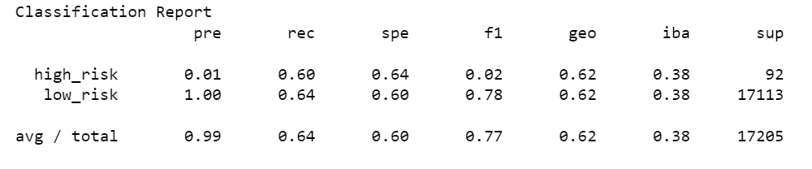
 
-	The high_risk precision is 1% with a sensitivity of 60%, making the F1 a 2%.
-	The low_risk precision is 100% with a 64% sensitivity, making the F1 an 80%.
-	The average precision of this model is a 99% with a sensitivity of 64%.

## Undersampling
In undersampling, the size of the majority is decreased until the majority and minority classes are balanced. We will be testing Cluster Centroids algorithms to determine if it has better performance compared to oversamplings. In undersampling, our resampled target values are the following:
-	Low_risk: 255
-	High_risk: 255

<b>Balanced accuracy score:</b> 50.8% 

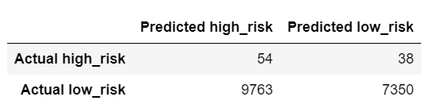

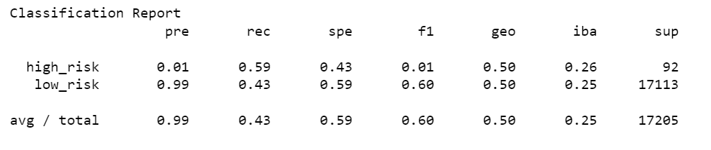

-	The high_risk precision is 1% with a sensitivity of 59%, making the F1 a 1%.
-	The low_risk precision is 99% with a 43% sensitivity, making the F1 an 60%.
-	The average precision of this model is a 99% with a sensitivity of 43%.

### Combination
We will be testing a combination of over- and under-sampling algorithm to determine if the algorithm results in the best performance compare to the other sampling algorithms above. In combination, our resampled target values are the following:
-	Low_risk: 62022
-	High_risk: 68458

<b>Balanced accuracy score:</b> 64.9%

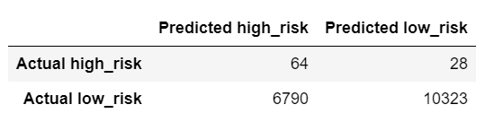

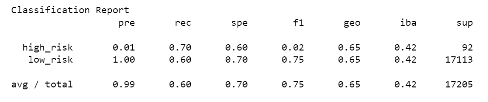
 
-	The high_risk precision is 1% with a sensitivity of 70%, making the F1 a 2%.
-	The low_risk precision is 100% with a 60% sensitivity, making the F1 an 75%.
-	The average precision of this model is a 99% with a sensitivity of 60%.

## Ensemble Learners
The concept of ensemble learning is the process of combining multiple models, like decision tree algorithms, to help improve accuracy and robustness, as well as decrease variance of the model, and therefore increase the overall performance of the model.

### Balanced Random Forest Classifier
<b>Balanced accuracy score:</b> 77.8%

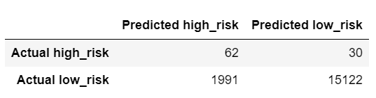

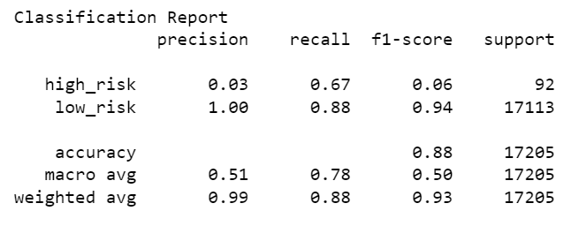
 
-	The high_risk precision is 3% with a sensitivity of 67%, making the F1 a 6%.
-	The low_risk precision is 100% with a 88% sensitivity, making the F1 an 94%.
-	The average precision of this model is a 99% with a sensitivity of 88%.

The following are five features that are most relevant when analyzing credit card risk:
(0.08232559188092942, 'total_rec_prncp'),
(0.07514935891577482, 'total_pymnt_inv'),
(0.05295780612873343, 'total_rec_int'),
(0.05172193147881896, 'last_pymnt_amnt'),
(0.050666329293744046, 'total_pymnt'),

### Easy Ensemble AdaBoost Classifier
<b>Balanced accuracy score:</b> 92.9% 

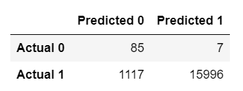

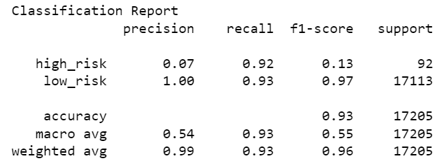
 
-	The high_risk precision is 7% with a sensitivity of 92%, making the F1 a 13%.
-	The low_risk precision is 100% with a 93% sensitivity, making the F1 an 97%.
-	The average precision of this model is a 99% with a sensitivity of 93%.

## Recommendation
When analyzing six machine learning modules, the Easy Ensemble AdaBoost Classifier was found to be the best model to predict credit risk. The model’s accuracy is the highest with a 92.9%. Also, the precision average was a 99%, meaning a high precision is indicative of a low number of false positives. The recall average was a 93%, meaning a high recall is indicative of a low number of false negatives. This model also has the highest F1 score with an average of 69%. F1 score is a weighted average of the precision and recall. 
